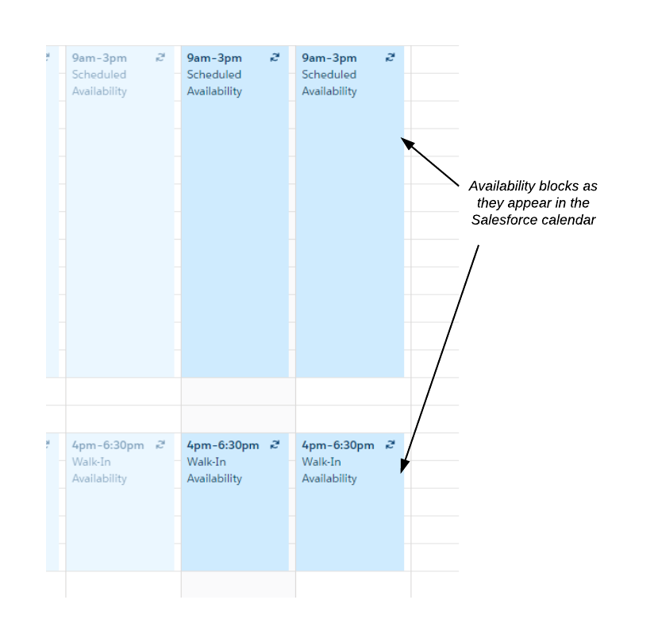
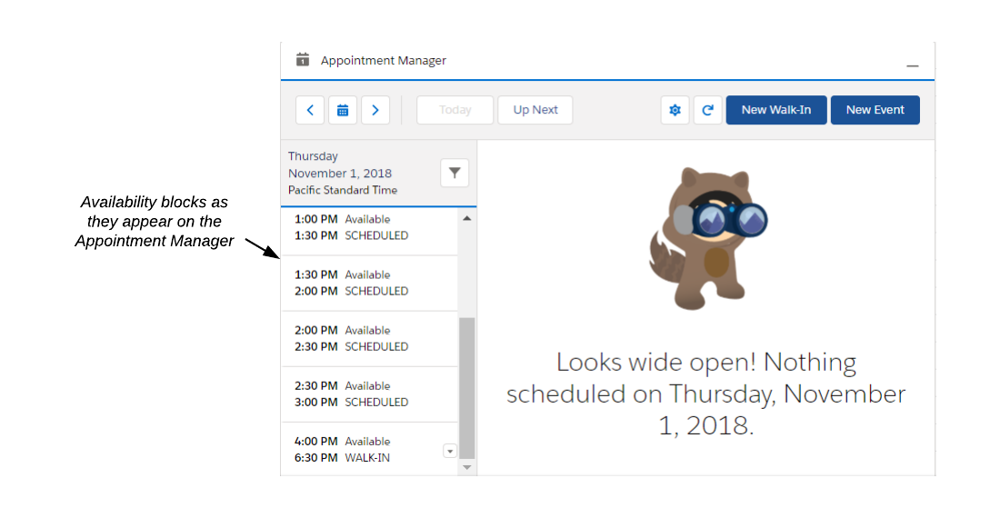
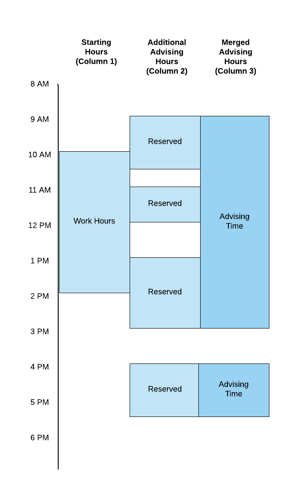
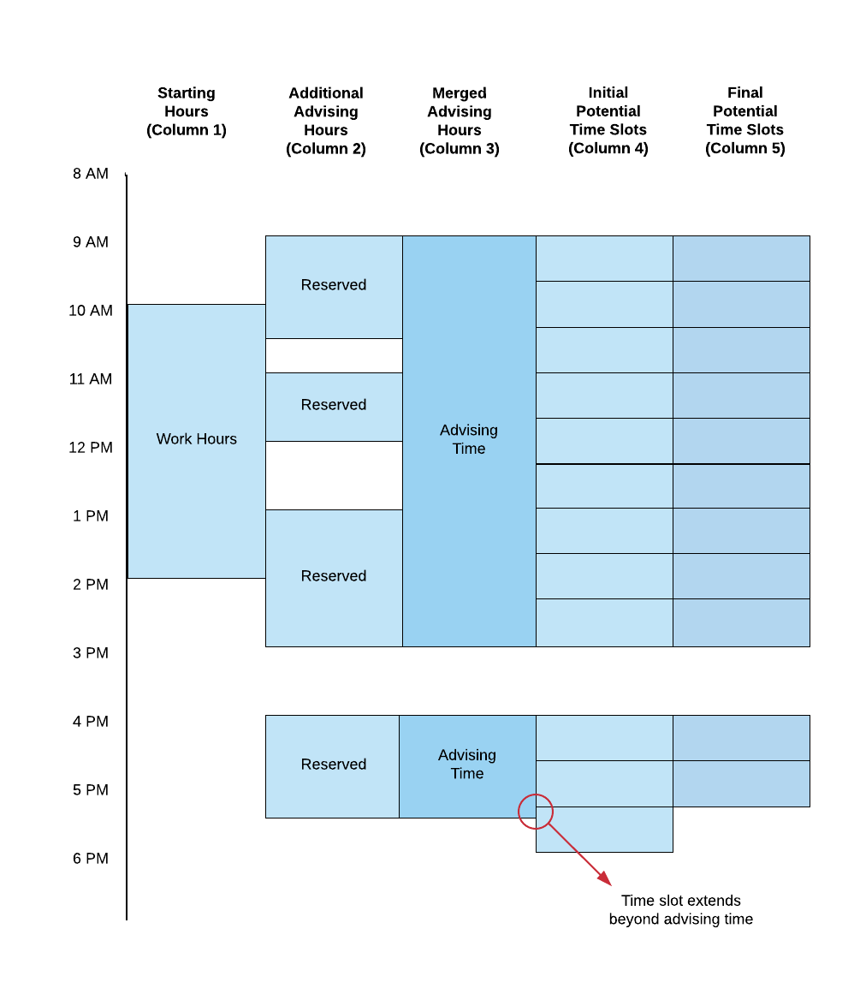
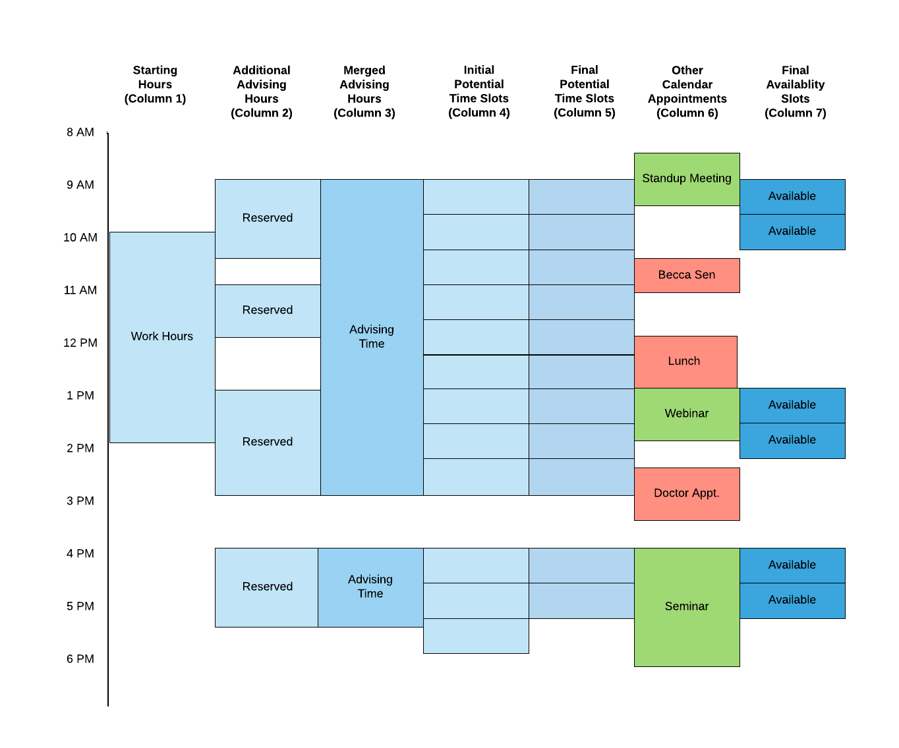
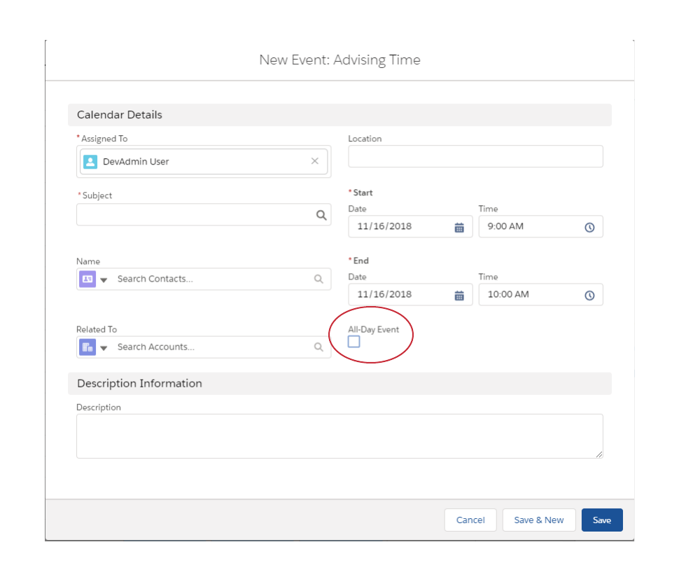
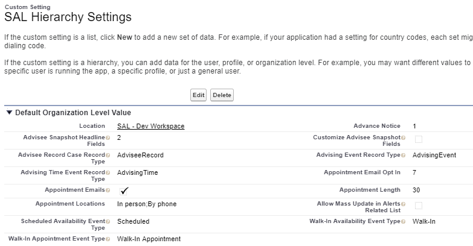
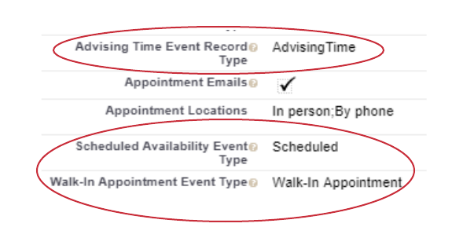
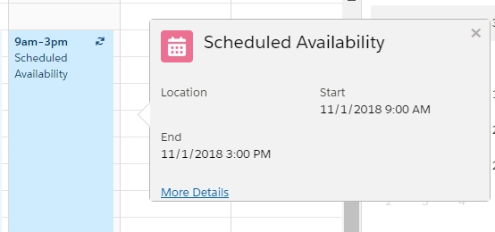

## Availability in SAL

The concept of availability is fundamental to SAL and its functioning. When we use the term "availability," we're referring to the blocks of time when advisors are available to meet with students. These times—called “availability blocks”—appear in multiple places within SAL, including:

* The Scheduling Wizard

* The Appointment Manager

* The Salesforce Calendar

* Advisor profile pages

Both Advisors and students view and use availability blocks to set up advising appointments at appropriate times (i.e., times when the advisor is available).
Here is how availability blocks look in the Salesforce calendar:

In the Appointment Manager, availability blocks appear as shown below:

# Types of Availability

There are two kinds of availability—Scheduled and Walk-in.

**Scheduled availability** allows an advisor to choose blocks of time in which students can then set up advising appointments with that advisor that start and end at a particular time. The time slots that comprise Scheduled availability are ultimately determined after the availability calculation is performed (see below).

**Walk-in availability** allows students to see advisors on a "walk-in" basis, without scheduling a particular time. In this case, advisors simply set a block of time that they are available for walk-in appointments. The students then see this time, and can come to the specified location during that time block to speak with an advisor.

Both Scheduled and Walk-in availability blocks can be set at overlapping times. That is, SAL does not prevent advisors from setting a Scheduled availability block at the same time as a Walk-in availability block, though it is unlikely that an advisor will want to do so. Just as different advisors have different work schedules, they also differ in the ways they approach advising appointments; some prefer scheduled appointments while some prefer walk-ins.

The ability to create a "one time" event (where an advisor goes to the Salesforce calendar and creates a single availability event) is helpful if the advisor doesn't have a regular schedule, or perhaps has extra time for appointments. Often, however, advisors will want to create recurring availability events.

# Recurring Events

Recurring availability events are typically set by advisors who work the same hours each week—for example, a full time advisor who works 9am to 5pm each weekday, or a part-time advisor who regularly works Mondays, Wednesdays, and Fridays. These advisors use recurring availability to define their regular advising hours.

Recurring availability events are created in basically the same way as one-time events. First, the parent occurrence is defined in the Salesforce calendar with the applicable Record Type (usually "Advising Time"). Then the start and end times (and any other parameters) for the event are set. Then the parameters for when the event will repeat are set.

When a parent occurence is defined in the calendar, Salesforce creates all the child occurrences of the event, populating the calendar according to the parameters specified. If the chosen Record Type for the parent event is "Advising Time," all the of the child events will have that Record Type as well. That means that they will all be considered availability blocks.

Recurring events can also be created through the custom interface (which was created before the Salesforce calendar supported recurring events but is still part of SAL). This interface is reached through *Advisor Settings* in the Appointment Manager.

Ultimately, the manner in which the availability event is created is less important than the event on the Salesforce calendar having the proper Record Type (i.e., Advising Time.)

# The Availability Calculation

At the heart of Availability is the *Availability Calculation*. It is this calculation that ultimately determines the days and times that advisors are available for scheduled appointments (i.e., Scheduled Availability blocks). In part, the data that results from the Availability Calculation drives what appears in the areas of the SAL interface involved with appointment scheduling (e.g., the Appointment Manager and the Scheduling Wizard).

Obviously, advisors are not available all the time for their students. Instead, advisors choose business hours/periods of time to make themselves available for students to schedule appointments. This action—choosing a time period in which appointments can be made—essentially "kicks off" the Availability Calculation. It is the first of several steps, each of which adds specific data to the calculation. When the calculation is complete, the advisor's actual availability is determined and displayed in various places within SAL. Advisees can then view the advisor's availability and schedule an appointment.

If an advisor does not choose a block of time, he/she will not be shown as available for either scheduled or walk-in appointments.

**Note:** No specific availability calculations are performed for Walk-in availability blocks. Advisors simply set a block of time that they are available for Walk-in appointments. These blocks are then displayed to advisees.

## Availability Calculation Steps

For scheduled availability (remember, no time slot calculations are performed for walk-in availability), the availability time that the advisor provides is automatically broken into multiple available time slots. That is, the advisor defines one window of time, and also tells the system how long each appointment should be. Then, those figures are used to calculate the actual available time slots.

For example, if the advisor defines an Advising Time event on the calendar from 10am to 1pm, and has set appointment length to 15 minutes, that original 3-hour window will be divided into 12 separate available time slots.

### Step 1—Overlapping Time Blocks are merged into a single block

More than 1 available time block can be defined for the same time on the calendar. This can occur when there is already a recurring available time block on the calendar, and the advisor then defines an additional available time block that concurs or overlaps with the first one. When this happens, the overlapping times are merged into one block.

For example: a recurring availability event is defined for 9am to 3pm. The advisor then defines another availability block from 12pm to 5pm. These two events overlap between 12pm and 3pm, so the two events are merged into one larger Advising Time event from 9am to 5pm.

The merging of availability blocks is the first step in the calculation process. Look at the image below. In the first column, you see the first availability block set—from 10:00 am  to 2:00 pm. The second column shows additional availability blocks that the advisor reserved. Finally, the third column shows all of the block merged into a larger time block. However, the block of time from 4:00 pm to 5:30 pm does not overlap with a previous time, and because it stands apart from the other times, it is its own availability block. Going forward, these two blocks will be two separate availability blocks.

### Step 2—Availability Blocks are split into potential appointment slots

Once the availability blocks are merged into bigger blocks, they are then divided into potential appointment slots. The length of these slots is determined by the advisor's desired appointment length.

For this example, we will use a desired appointment length of 40 minutes. So, starting at the beginning of each time block (Column 3), the blocks are split into 40 minute chunks. These are shown in the fourth column below:

Notice that the last potential time slot in Column 4 begins within an advising time slot but then extends beyond it. Since the advisor has already specified not to have any advising appointments past 5:30 pm, that last potential time slot is deleted. This leaves the final potential time slots (Column 5).

### Step 3—Adding other calendar events

So far, the calculation has only looked at the events on the calendar with a Record Type of Advising Time. Now, the calculation looks at all the other events on the calendar; in other words, the events that have a Record Type other than Advising Time. These events could be staff meetings, personal appointments, and so on, and are shown in Column 6:

Salesforce calendar events have a "Show as" property associated with them. This property can be either Busy, Free, or Out of Office. Events that have a “Show Time As” property of Busy or Out of Office are considered by SAL as busy times, and preclude advising time slots from being displayed. Events with a “Show as” property of Free do not block advising time slots.

**Note:** When determining busy times, all-day events are ignored. (See the section *All-Day Events*, below.)

Take a look at the events in Column 6. The events in green are marked as Free. The events in red are marked as Busy. The event "Daily Staff" is green, so the advisor is free to meet with advisees. Therefore, the time slots are not deleted and pass through the calculation (Column 7). However, the event with Becca Sen is red, meaning it's considered Busy. Note that it overlaps two potential time slots. When that happens, the potential time slots that overlap are deleted by the calculation. They are no longer available for advising meetings, so they do not show up in Column 7.

Finally, any potential time slots that began before the current time are deleted. (For example, if the current time is 11:10 am, and the potential time slot begins as 11:00 am, the time slot is deleted.)

Once the calculation completes, the available time slots for advising show up in the Appointment Manager, Scheduling Wizard, and so on.

# Advance Notice

Advance notice prevents advisees from booking an appointment too close to the current time. For example, if the current time is 10:58 am, and there is an available time slot at 11:00 am, an advisee could potentially book that time and the advisor might not even receive the notification before the advisee shows up for the appointment. Advance notice prevents such a scenario from happening.

Advance notice is set in hours in the Advisor Settings dialog. So if advance notice was set for 1 hour, and the current time is 10:58 am, an advisee could not book an appointment for 11:00 am, but they could book an appointment for noon. Any amount of hours can be set for advance notice, including zero.

# All Day Events

When creating a new Advising Time event, SAL presents an All-Day Event checkbox. However, all-day events are not supported for defining availability blocks, and using this checkbox may lead to unexpected and inconsistent results.

# Hierarchy Settings

Several properties of availability are controlled in the Hierarchy Settings for SAL. These include Advance Notice and Appointment Length, as well as the Record Type and Event Types for advising events.

**Note:** To access Hierarchy Settings, go to *Setup *> *Custom Code* > *Custom Settings* > *Manage SAL Hierarchy Settings*.

Hierarchy Settings can be defined at three different levels: Org level, Profile level, and User level. Settings defined at the Org level act as a "default" level, though they can be overridden at at the Profile and User levels.

# Record Type and Event Type

Availability blocks always have a start time and an end time, and are always on a particular day. So the easiest and simplest way to create an availability block is to create an event in your Salesforce calendar. 

**Note:** Remember, Walk-in availability is also set by creating an event on the calendar. However, as mentioned previously, no additional calculations are performed on walk-in availability. Once the advisor sets the start and end time for a walk-in availability block, it is set.

Availability events are distinguished from other event types on the calendar through choosing the proper *R**ecord Type*. 

There is a custom setting that defines which Record Type actually gets used for availability, but generally this option is set to "Advising Time." So, when you select Advising Time as the Record Type for the event, SAL knows you are creating an availability block. 

The "Advising Time Event Record Type" setting corresponds to the developer name of the Advising Time Record Type defined on the Event object. All availability events must be of the Record Type specified in this field. This is a configurable value, but in this example the name given is *AdvisingTime*.

However, the Advising Time Event *Record *Type does not determine if the event is a scheduled event or a walk-in event. That is determined by the *Event *Type. There are two availability event types (both shown in the image above):

* Scheduled Availability Event Type

* Walk-In Appointment Event Type

When creating an availability block event, the advisor will be asked to choose the event type. Using the values shown in this example, if the advisor chooses Scheduled as the event type, the advising event will be a scheduled advising event. But if the advisor chooses Walk-In Appointment as the event type, the advising event will be a walk-in.

# Viewing Availability Events

The best way to view availability events and the data associated with them is through the Salesforce calendar. Clicking on an advising event in the calendar allows you to view details about it:

In cases where the SAL instance has been configured to do so, the Record Type and Event type for the event can be viewed by selecting the *More Details* link.

<!--stackedit_data:
eyJoaXN0b3J5IjpbLTcwMjM0NTk2NSwxNzkwMjE3NDI3XX0=
-->